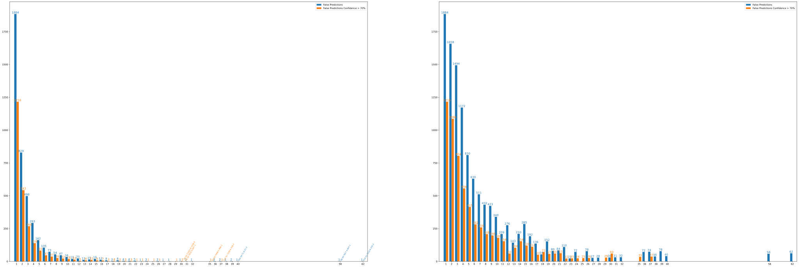
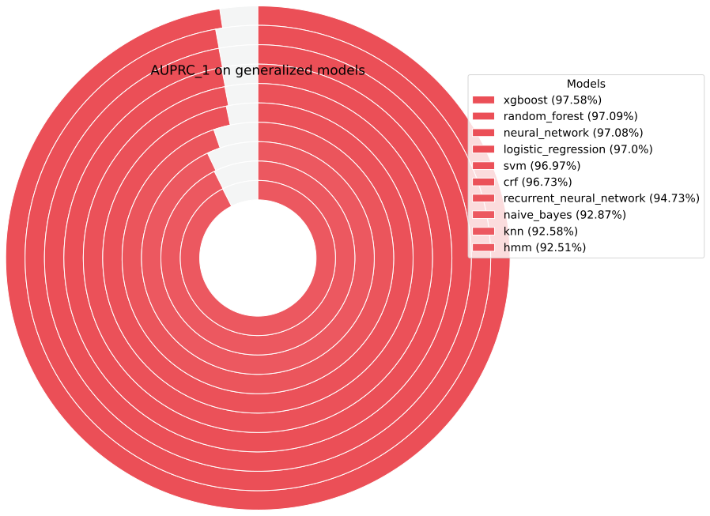
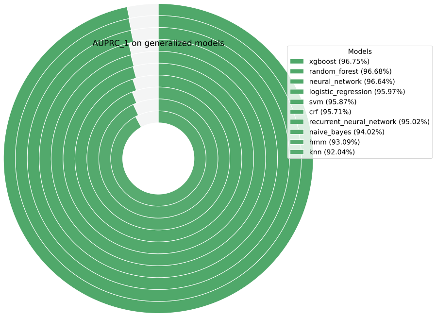

# migrave_models

__Author__: Alex Mitrevski, Mohammad Wasil, Julian Schanowski\*
__Last update__: 13.07.2023
__Initial release__: 19.06.2023
__License__: Copyright© 2023, Rheinische Fachhochschule gGmbH (RFH) - all rights reserved; see LICENSE 

\* *Code/Documentation: AM, MW, JS; Review/Documentation: SA*

<details>
  <summary>Click to expand table of contents</summary>

- [migrave_models](#migrave_models)
  - [Purpose](#purpose)
  - [Logic](#logic)
  - [Classes](#classes)
  - [Data specs](#data-specs)
  - [Classifier](#classifier)
  - [Development Environment](#development-environment)
    - [Recreate environment](#recreate-environment)
  - [Installation](#installation)
  - [How to...](#how-to)
    - [training a new model](#training-a-new-model)
    - [test annotation](#test-annotation)
    - [tune parameters](#tune-parameters)
    - [generate outputs](#generate-outputs)
  - [Known bugs and shortcomings](#known-bugs-and-shortcomings)
  - [Performance](#performance)
    - [Learning data survey](#learning-data-survey)
    - [Field study](#field-study)
  - [Repo structure](#repo-structure)
  - [Visualizations](#visualizations)
</details>

---

## Purpose
This repository is used to train and evaluate different models for engagement classification in the MigrAVE project. In
specific this branch builds on top of the [main](https://github.com/migrave/migrave_models/tree/main) branch which
already included the basic functionalities. This includes a training pipeline covering most of the models and the
process described in
```
S. Jain, B. Thiagarajan, Z. Shi, C. Clabaugh, and M. J. Matarić, "Modeling engagement in long-term, in-home socially
assistive robot interventions for children with autism spectrum disorders," Science Robotics, vol. 5, no. 39, 2020.
```
This [first-trial](https://github.com/migrave/migrave_models/tree/first_trial) branch is tailored to the real data from
the first MigrAVE survey which differs from the data describes by Jain et al. for instance in the number of used
cameras. Furthermore, the main branch is extended by functionalities for filtering issues in annotation, some
hyperparamter tuning and by the models missing from Jain et al. plus some additional. In addition, the evaluation has
been extended by a soft-voting element to test how the fusion of multiple models (for instance one for each camera)
works. However, not all scripts from the main branch but only the script necessary for running the complete training and
evaluation pipeline have been adapted. For instance the ``train_classifier.py`` script, which solely trains a single
classifier is part of future work.

## Logic
In the first trial of the MigrAVE survey participants where recorded in two sessions playing an imitation and an emotion
game with the QT robot. Those recordings where annotated for engagement. Features where extracted using the
[MigrAVE_Preprocessing](https://github.com/RFH-MMI/MigrAVE_Preprocessing) repository. Those data was then used to train
multiple classifiers to find the one which performs best on the collected data. This works by running an experiment.
An experiment is described in a config file where you can set classifiers to train and also some filters and parameters
(like excluding features, modalities and cameras to use). For each experiment the classifiers are cross validated and
the models and evaluation metrics are saved for each cv-split and their mean is compared to the other classifiers. For
testing a soft-voting approach, the stored models from different perspectives can be loaded and are used to generate new
predictions for all samples. Those predictions are evaluated in the same way as before.

## Classes
We model engagement at two different levels, with labels `0` and `1`:
* `disengagament`: 0
* `engagement`: 1

Annotation guidelines can be found on the server under
[AP3.1.3 Annotation](https://cloud.rfh-koeln.de/index.php/f/70320611)

## Data specs
A multimodal dataset is recorded which includes three RGB cameras, one depth camera, two microphones and the game
performance of the participants. For more details on the raw data see Jain at al. and the
[MigrAVE_Preprocessing](https://github.com/RFH-MMI/MigrAVE_Preprocessing) pipeline. The features extracted by the
pipeline can be found on the server under [AP3.1.4 Modell-Training](https://cloud.rfh-koeln.de/index.php/f/76778076). A
full backup of the features including the intermediate steps can be found on the harddrive ("MigrAVE 3 2022") under
``../Lerndatenerhebung/MigrAVEFeatures/13_07_2023/``.


## Classifier
Multiple classifiers are used in the training pipeline and are compared with each other in the evaluation. The
classifiers available for training are (**bold** for classifiers used by Jain et al., *italic* for sequential
classifiers):

* **Random Forest**
* **XGBoost**
* **Support Vector Machine**
* **K-Nearest Neighbors**
* **Naive Bayes**
* **Logistic Regression**
* **Neural Network**
* _**Recurrent Neural Network**_
* _**Hidden Markov Model**_
* _**Conditional Random Fields**_
* AdaBoost
* CatBoost
* LightGBM

Most of those classifiers take a random sample and predict the probability of the sample beeing class ``0`` or ``1``.
The classifiers in *italic* are sequential classifiers for which the order of the samples is relevant.

## Development Environment
OS: Ubuntu 20.04
Lang: Python
Tools: Anaconda, CUDA

Some classifiers like XGBoost can run on GPU. If no GPU is available you might need to change some parameters of those
classifiers set to run on GPU.
    
### Recreate environment
**TODO: create rquirements.yml**

Make sure you have conda installed. `cd` to this repository and run the following line to create an environment
"migrave_models" with all requirements installed.

```bash
conda env create -f requirements.yml
```

## How to...

### training a new model
1. Place the feature sets `features_video_color.csv`, `features_video_right.csv` and
`features_video_left.csv` in `../migrave_models/engagement_estimation/dataset/`. The feature sets a stored on the 
server (see [Data specs](#data-specs)).
2. Create one or more config files and place them in ``./migrave_models/engagement_estimation/config/``. Each file is
used for one experiment. All experiments will run sequentially. A config file should have this format:
```yaml
model_types:
    - generalized
    - individualized
models:
    - random_forest
    - xgboost
    - adaboost
    - svm
    - knn
    - naive_bayes
    - logistic_regression
    - neural_network
    - recurrent_neural_network
    - hmm
    - crf
    - catboost
    - lightgbm
modalities:
    - video
    - audio
    - game
datasets:
    - features_video_color.csv
    - features_video_right.csv
    - features_video_left.csv
minority_weight_factor: 1
label_issue_file: /full/path/to/label_issue_file.csv
exclude_feature_regex: ^op.*|^of_ts_success.*|^ros_skill.*|^ros_mistakes.*|ros_games_session|ros_ts_game_start|^ros_diff.*|ros_aptitude.*|^of_success_.*
exclude_samples_regex: ^of_success_features.*
experiment_name: experiment_name
```
This template config includes the complete set of all possible settings. To train only on a subset remove the desired
list elements. All non list arguments can be left empty as default.

* `model_types`: List of model types to train. `individualized` models are trained on a single participant and tested on
a late subset of the participants' data. `generalized` models are leave-one-out cross validated for each participant.
* `models`: List of models to train.
* `modalities`: List of modalities to use.
* `datasets`: List of datasets to use. If more than one is used, redundant features from multiple camera perspectives
will be used to train each model.
* `minority_weight_factor`: Some models use a class weigth to deal with class imbalance. use this factor to further
increase the weight of the minority class (default is `1`).
* `label_issue_file`: File with label issues to be excluded. This can be used for a **second** training run. See
[test annotation](#test-annotation) below.
* `exclude_feature_regex`: regex of features to be excluded. The regex in the config template excludes all features
from Jain at al. not used in the MigrAVE model either because not relevant while computational expensive (`^op.*`for
OpenPose features) or limiting the scalability of the games (time or specific game related).
* `exclude_samples_regex`: regex of boolean features to exclude. `^of_success_features.*` excludes all samples where no
camera was able to detect a face. This case will be handled by a coping reaction.
* `experiment_name`: Name of the experiment to save the results to. Results will be saved under
`../migrave_models/engagement_estimation/logs/experiment_name/modality_id/datasets_id/` and contain models and
evaluation results.

The results of one experiment will be stored in the following format:
```bash
../logs/
└── experiment_name
    └── video_audio_game
        └── features_video_right_features_video_left_features_video_color
            ├── config_experiment_name.yaml
            ├── generalized_xgboost.csv
            ├── generalized_xgboost_model_tested_on_1.joblib
            ├── generalized_xgboost_model_tested_on_2.joblib
            ...
            ├── generalized_xgboost_model_tested_on_29.joblib
            ├── generalized_neural_network.csv
            ├── generalized_neural_network_model_tested_on_1.h5
            ├── generalized_neural_network_model_tested_on_1.joblib
            ├── generalized_neural_network_model_tested_on_2.h5
            ├── generalized_neural_network_model_tested_on_2.joblib
            ...
            ├── generalized_neural_network_model_tested_on_29.h5
            ├── generalized_neural_network_model_tested_on_29.joblib
            └── images
                ├── generalized_Accuracy.png
                ├── generalized_Accuracy.svg
                ├── generalized_AUPRC_0.png
                ├── generalized_AUPRC_0.svg
                ...
```
The config file is stored here as well for reproducibility reasons. The CSV file for each classifier and model type
contains the evaluation results (metrics, confusion matrices) for all leave-one-out-splits. Classifiers are usually
stored as a JOBLIB file together with normalization values. However, classifiers trained with tensorflow like
(Recurrent) Neural Networks are stored as H5 file and their normalization values are stored separately as JOBLIB file.
The `../image/` directory contains plots of the evaluation means of all trained classifiers to compare them.

### test annotation
The annotation of engagement labels is a major source of possible complications regarding the classification quality. To
deal with this issue we used [cleanlab](https://github.com/cleanlab/cleanlab) to test the annotation quality. cleanlab
uses the annotation and the predictions (probabilities) of a classifier to calculate a label quality score. Thus, you
need to run an experiment first and use the classifiers from this experiment to create label issue file. Finally, you
can include this file in a config file and run a new experiment with the annotation issues being excluded. For now this
only works for generalized model types.

To create the label issue file run the ``test_annotation.py`` script with the ``create`` option:

````bash
cd ../migrave_models/engagement_estimation
conda activate migrave_models
python test_annotation.py create --experiment_dir ../migrave_models/engagement_estimation/logs/experiment_name
--modalities video audio game --datasets features_video_right.csv features_video_left.csv features_video_color.csv
--classifier_name xgboost --voting 1
````

The `--experiment_dir`, `-ed` argument is the path to the experiment, `--modalities`, `-md` and `--datasets`, `-ds` are
the modalities and datasets/perspectives you want use to test the classifier `--classifier_name`, `-cn`. The argument 
``--voting``, `-v` is used to change between a regular classifier (parse `0`) or a soft-voting classifier (parse `1`).
In regular mode the datasets will be interpreted as a list of datasets used in a single classifier. Thus, the script
expects that an experiment with all those datasets in one config file has been run before. In soft-voting mode the
datasets are interpreted as separate classifiers. Thus, the scripts expects that for the parsed experiment directory,
modalities and classifier name separate config files with single datasets for each dataset in the list has been run
before. The label issue file will be stored in the experiment directory parsed.

To merge multiple label issue files (with an AND operator) use the ``merge`` option. This option is useful to create an
intersection of issues when testing a soft voting classifier based on classifiers with independent label issues:

````bash
cd ../migrave_models/engagement_estimation
conda activate migrave_models
python test_annotation.py merge --label_issues ../features_video_color_xgboost_cross_validation_issues.csv ../features_video_left_xgboost_cross_validation_issues.csv ../features_video_right_xgboost_cross_validation_issues.csv
--out_dir ../out_dir
````

The ``--label_issues``, ``-li`` argument are the label issue files to be merged and the ``--out_dir``, ``-o`` is the
directory to save the merged file to.

### tune parameters
By default, the hyperparameters by Jain et al. have been used on all models. To further increase the classification
quality a tuning pipeline has been built for the XGBoost classifier (best classifier by jain et al.).
For the pipeline [PHOTONAI](https://github.com/wwu-mmll/photonai) was used. However, the results could not be improved
by hyperparameter tuning and thus was not used. Please refer to the PHOTONAI tutorials and run the
``../migrave/engagement_estimation/tune_paramters.py`` script in an IDE. THE XGBoost classifier class from
``../migrave/engagement_estimation/photon_custom_transformer/XGBoostClassifier.py`` must be registered first.

### generate outputs
Multiple outputs for face validity and to get an insight in the prediction errors can be generated by functions
implemented in the `../migrave_models/engagement_estimation/generate_classifier_outputs.py` script. All of those
functions work on based already trained and stored models. Thus, you need to run the training first. By now this script
should be used in an IDE. Simply execute the desired function at the bottom of the script and use the docstrings for
more details. Useful functions are:

* `generate_prediction_video()`: Generates a video with the participants video and the live prediction of the classifier
and the annotation as ground truth (**Soft-Voting Classifier not implemented yet**).
* `create_feature_list()`: Creates a CSV file of the features used in a stored classifier.
* `get_xgboost_cv_feature_importance()`: Returns the mean of the feature importance of the cross validated XGBoost
models.
* `create_cv_predictions()`: Returns a dataframe with the cross validated predictions of a classifier.
* `create_cv_voting_predictions()`: Returns a dataframe with the cross validated predictions of classifiers from
multiple perspectives fused with a soft-voting approach.
* `create_cv_voting_results()`: Creates the same evaluation results as used in the training pipeline but for classifiers
from multiple perspectives fused with a soft-voting approach and stores them as a CSV file.
* `get_result_stats()`: Generates means of metric of one results file (e.g. cross validated XGBoost model in one
experiment)
* `plot_error_dist()`: Generates a histogram like bar plots of the distribution of the segment lengths of false
predictions with total number and total duration as y-axis.


## Performance
The complete data collected in the MigrAVE project is split into data from (1) the learning data survey and (2) the
field study. First the data from (1) has been collected and was used to train an initial classifier. Later this
classifier was flashed on the robot and has been used for (2). In (2) more date from new participants was collected and
was used to test the classifier from (1). Finally, the complete data from (1) and (2) was used to train a new classifier
aiming to improve the overall classification quality.
### Learning data survey
Various combinations of modalities and perspectives were tested. The best overall performance was achieved with XGBoost
classifier using all modalities and all perspectives in one classifier. However, this classifier is not used in the
final system due to following reasons:

* Some game related features restrict the scalability of the game design. For instance the time, score or game category
related features must be excluded as new games will have longer durations, scores or categories.
* Audio features did not increase the prediction quality significantly and their feature importance was relatively low.
Thus, can be excluded to save computational resources.
* OpenPose features did not increase the prediction quality significantly and their feature importance was relatively
low. Thus, can be excluded to save computational resources.
* In real world scenarios single cameras might not work. In that case the whole classifier would fail. Three separate
classifiers, one for each camera and fused with a soft-voting classifier would be more robust.

The classifiers have been tested with different label issue files (see [test annotation](test annotation)). In the first
round three classifiers, one per perspective, were trained on all samples then:

1. the classifiers were used as a soft voting classifier and one label issue file was created on those results. In a
second round three classifiers were trained again ignoring the samples with label issues. Finally, the classifiers of
the second round were evaluated as soft voting classifiers using the same label issue file as before.
2. the classifiers were used separately to create one label issue file for each perspective. In a second round three
classifiers werde trained again using their corresponding label issue file. Finally, the classifiers of the second round
were evaluated as soft voting classifier removing the intersection of the issues of all three label issue files (AND).

The second approach proved to be the most suitable for the experimental setup, so these classifiers were further used.

In the final system soft-voting classifier with a reduced feature set (see list above) is used. The performance is
slightly reduced compared to single classifier. All results, label issue files and classifiers can be found on the
harddrive ("MigrAVE 3 2022") under ``../Lerndatenerhebung/MigrAVEModels/13_07_2023/migrave_models/engagement_estimation/logs``. The three
classifiers used in the system and their results can be found on the server under
[AP3.1.4 Modell-Training](https://cloud.rfh-koeln.de/index.php/f/76778077). The performance of the soft-voting
classifier is described below (all scores are means of the leave-one-out cross validation), rounding errors apply. Also
keep in mind, that the soft voting results ar not directly comparable to the separate classifiers, as the classifiers
were tested with respect to the perspectives label issues and the soft voting classifier with respect to their
intersection.


| Metric            | Score | Chance |
|-------------------|-------|--------|
| AUPRC_0           | 0.602 | 0.136  |
| AUPRC_1           | 0.972 | 0.863  |
| Recall_0          | 0.712 | 0.5    |
| Recall_1          | 0.904 | 0.5    |
| Precision_0       | 0.518 | 0.136  |
| Precision_1       | 0.950 | 0.863  |
| F1_0              | 0.568 | 0.214  |
| F1_1              | 0.924 | 0.633  |
| AUROC             | 0.904 | 0.5    |
| Accuracy          | 0.886 | 0.5    |
| Balanced_Accuracy | 0.808 | 0.5    |

Confusion Matrix:  

|      |            | predicted | predicted  |
|------|------------|-----------|------------|
|      |            | engaged   | disengaged |
| true | engaged    | 80079     | 8127       |
| true | disengaged | 3901      | 10075      |


AUPRC scores for both classes in comparison between all tested classifiers for all three perspectives:

|              |                      engagement                       |                     disengagement                     |
|--------------|:-----------------------------------------------------:|:-----------------------------------------------------:|
| camera right |  |  |
| camera left  |   |   |
| camera color |  |  |

### Field study
The new dataset from the field study has been tested on the soft voting classifier described above. However, the
classification quality was significantly worse the cross-validated-results from the learning-data-survey.

| Metric            | Score | Chance |
|-------------------|-------|--------|
| AUPRC_0           | 0.468 | 0.21   |
| AUPRC_1           | 0.897 | 0.79   |
| Recall_0          | 0.483 | 0.5    |
| Recall_1          | 0.817 | 0.5    |
| Precision_0       | 0.448 | 0.21   |
| Precision_1       | 0.855 | 0.79   |
| F1_0              | 0.419 | 0.296  |
| F1_1              | 0.829 | 0.612  |
| AUROC             | 0.752 | 0.5    |
| Accuracy          | 0.757 | 0.5    |
| Balanced_Accuracy | 0.650 | 0.5    |

Confusion Matrix:  

|      |            | predicted | predicted  |
|------|------------|-----------|------------|
|      |            | engaged   | disengaged |
| true | engaged    | 33647     | 7575       |
| true | disengaged | 5507      | 5460       |

The worse performance quality is most likely due to inhomogeneity between the data of the (1) learning data survey and
the (2) field study in example the amount of persons in the camera frame or the setup of the robots/cameras position. 
This can be seen in some feature distributions, exemplary the confidence of the face detection in the
[figure](of_confidence_dist) below where the overall detection of the face works significantly better in the learning
data survey, especially for the upper webcam (`features_video_right`).


The three classifiers were trained again exactly as described in the [section](learning-data-survey) above this time
using both datasets from the learning data survey and the field study combined. The classification quality is described
below (1) the data from the learning data survey (LDS) and (2) for the field study (FS) data separately and (3) for the
full (FULL) dataset.

| Metric            | Score | Chance | Score | Chance | Score | Chance |
|-------------------|-------|--------|-------|--------|-------|--------|
|                   | LDS   | LDS    | FS    | FS     | FULL  | FULL   |
| AUPRC_0           | 0.61  | 0.165  | 0.531 | 0.163  | 0.579 | 0.164  |
| AUPRC_1           | 0.973 | 0.835  | 0.906 | 0.837  | 0.947 | 0.836  |
| Recall_0          | 0.672 | 0.5    | 0.682 | 0.5    | 0.676 | 0.5    |
| Recall_1          | 0.916 | 0.5    | 0.728 | 0.5    | 0.841 | 0.5    |
| Precision_0       | 0.552 | 0.165  | 0.432 | 0.163  | 0.504 | 0.164  |
| Precision_1       | 0.949 | 0.835  | 0.876 | 0.837  | 0.92  | 0.836  |
| F1_0              | 0.571 | 0.248  | 0.495 | 0.246  | 0.541 | 0.247  |
| F1_1              | 0.93  | 0.625  | 0.784 | 0.626  | 0.872 | 0.626  |
| AUROC             | 0.904 | 0.5    | 0.787 | 0.5    | 0.858 | 0.5    |
| Accuracy          | 0.894 | 0.5    | 0.716 | 0.5    | 0.823 | 0.5    |
| Balanced_Accuracy | 0.794 | 0.5    | 0.705 | 0.5    | 0.759 | 0.5    |

Confusion Matrix:

|      |            | predicted | predicted  | predicted | predicted  | predicted | predicted  |
|------|------------|-----------|------------|-----------|------------|-----------|------------|
|      |            | LDS       | LDS        | FS        | FS         | FULL      | FULL       |
|      |            | engaged   | disengaged | engaged   | disengaged | engaged   | disengaged |
| true | engaged    | 81200     | 7116       | 26295     | 9964       | 107495    | 17080      |
| true | disengaged | 4101      | 9888       | 3663      | 6853       | 7764      | 16741      |

AUPRC scores for both classes in comparison between all tested classifiers for all three perspectives:

|              |                           engagement                            |                        disengagement                        |
|--------------|:---------------------------------------------------------------:|:-----------------------------------------------------------:|
| camera right |      |  |
| camera left  |       |   |
| camera color |      |  |

The [annotation](https://cloud.rfh-koeln.de/f/95840150), [features](https://cloud.rfh-koeln.de/f/95840151) as well as
the [results](https://cloud.rfh-koeln.de/f/95840708) of the field study evaluations and
[final models and results](https://cloud.rfh-koeln.de/f/95840342) can be found on the server. In addition, all models,
results and intermediate steps of the features can be found on the hard-drive under ``../Feldversuche/``.

## Repo structure
````bash
../migrave_models
├── LICENSE
├── README.md
└── engagement_estimation
    ├── README.md
    ├── assets
    │   ├── generalized_AUPRC_0_color.svg
    │   ├── generalized_AUPRC_0_left.svg
    │   ├── generalized_AUPRC_0_right.svg
    │   ├── generalized_AUPRC_1_color.svg
    │   ├── generalized_AUPRC_1_left.svg
    │   ├── generalized_AUPRC_1_right.svg
    │   └── video_game_voting_features_video_left_features_video_right_features_video_color.svg
    ├── config
    │   ├── config_color.yaml
    │   ├── config_left.yaml
    │   └── config_right.yaml
    ├── dataset
    │   ├── exclude_op_of_sucess_ros_scalable_video_game_voting_features_video_left_features_video_right_features_video_color_xgboost_cross_validation_issues.csv
    │   ├── features_video_color.csv
    │   ├── features_video_left.csv
    │   └── features_video_right.csv
    ├── generate_classifier_outputs.py
    ├── logger.py
    ├── logs
    │   └── experiment_name
    │       └── ...
    ├── models.py
    ├── photon_custom_transformer
    │   └── XGBoostClassifier.py
    ├── requirements.txt
    ├── test_annotation.py
    ├── test_classifier.py
    ├── train_and_eval_models.py
    ├── train_classifier.py
    ├── tune_parameters.py
    └── utils.py
````
